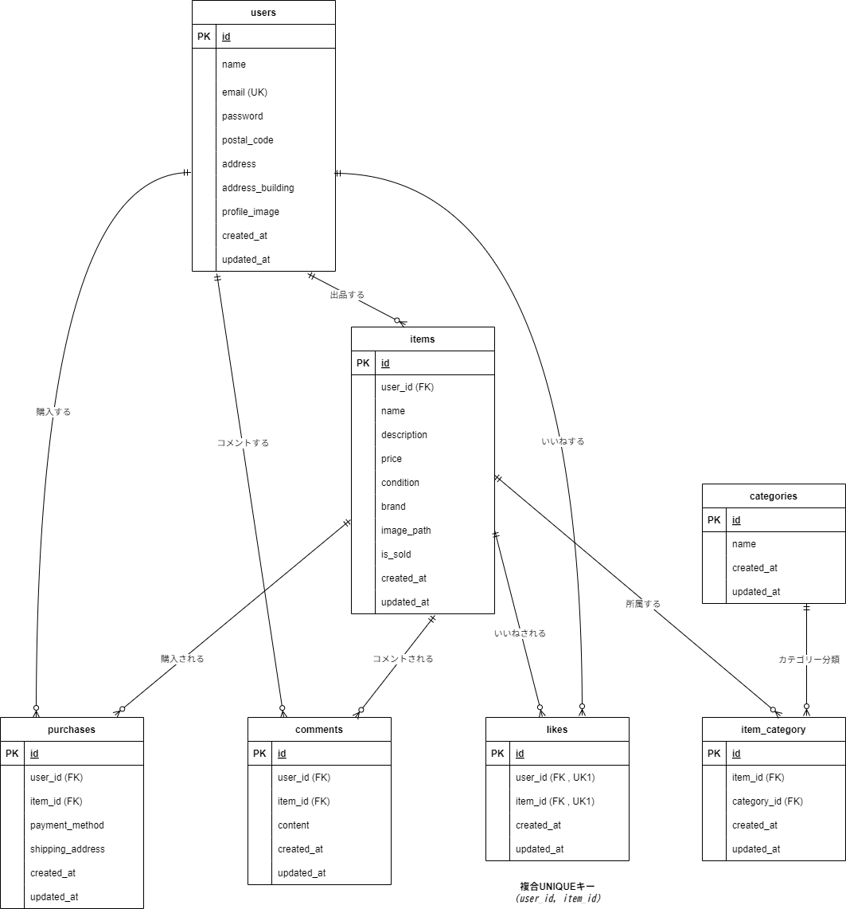

## アプリケーション名
模擬案件：フリマアプリ  

---

## ER図
下記は本アプリケーションで使用しているテーブルとリレーションを表したER図です。  

---

## プロジェクト概要
本プロジェクトは、Laravelを使用してアイテムの出品と購入を行う機能を備えたフリマアプリです。  
以下の機能を提供します。  

---

## 主な機能
- **ユーザー認証機能**
  - 会員登録（フォームバリデーション：メールアドレスの重複、パスワード8文字以上 など）  
  - ログイン／ログアウト（Fortify を利用）  
  - 初回ログイン時のプロフィール設定・編集  
  - **メール認証機能**  
    - 登録時に認証メールが送信され、リンクをクリックして認証を完了するまでログインできない仕様  
    - MailHogを使用して開発環境でメール送信を確認可能  
  - **パスワード表示切替機能**
    - 会員登録画面およびログイン画面のパスワード入力欄に目のアイコン「パスワードトグル（Password Toggle）アイコン」を設置  
    - アイコンをクリックすることで、入力したパスワードを表示または非表示に切り替え可能  
    - ユーザーが入力内容を確認しやすくなる工夫を実装  
- **商品一覧表示 (トップ画面)**
  - 全商品を表示  
  - 「売り切れ」のステータス表示  
  - ログイン済みの場合「マイリスト(いいね済み)」タブに切り替え可能  
- **商品詳細表示**
  - 商品名、説明、値段、状態、カテゴリ、ブランド など  
  - コメント一覧＆コメント投稿機能（最新のコメントが上に表示される、投稿日時の表示あり）  
  - コメントアイコンをクリックすることで、ページ内リンクでコメント欄に移動  
  - コメントアイコンの数字はコメント欄のコメント数と連動し、投稿後に即時更新される  
  - いいね数の表示・いいね追加／いいね解除、いいね追加済みのアイコンは黄色に変化  
  - 商品購入後は、購入手続きへボタンが消失する  
- **商品検索機能**
  - キーワード検索（部分一致）  
  - 検索履歴や検索結果のリスト表示  
- **出品機能**
  - 商品名、説明、価格、状態、カテゴリ、画像アップロード  
  - バリデーションエラー時はメッセージ表示  
- **購入機能**
  - 支払い方法選択（コンビニ支払い・カード支払い）  
  - Stripeを利用した決済処理を実装  
  - 配送先変更機能  
  - 商品購入後は 「sold」ラベルがアニメーションで表示  
- **マイページ (プロフィール)**
  - 購入履歴一覧、出品した商品一覧の閲覧  
  - プロフィール編集（住所、建物名、画像アップロードなど）  
---

## 必要な環境
- **PHP**: バージョン 7.3 以上
- **Laravel**: バージョン 8.75
- **Composer**: バージョン 2.0 以上
- **MySQL**: バージョン 8.0 以上
- **Docker**: バージョン 27.2.0 以上
- **Docker Compose**: バージョン 2.0 以上
- **MailHog**: バージョン 1.0 以上
  - メール送信を開発環境で確認するためのツール
- **Stripe**: 決済処理用のAPI  
  - `.env`ファイルに以下の内容を追加してください。
    ```dotenv
    STRIPE_KEY=your_test_public_key
    STRIPE_SECRET=your_test_secret_key
    ```
  - Stripe Dashboardにアクセスして、[テスト決済](https://dashboard.stripe.com/test/payments)を確認できます。  

---

## URL
ユーザ登録画面: http://localhost/register  
ログイン画面: http://localhost/login  
商品一覧画面（トップページ）: http://localhost/  
phpMyAdmin: http://localhost:8080  

---
## デフォルトのデータベース設定
`docker-compose.yml` で設定されているデータベースの初期情報は以下の通りです。  
デフォルトのパスワードをそのまま本番環境で使用しないでください。

- データベース名: `laravel_db`
- ユーザー名: `laravel_user`
- パスワード: `laravel_pass`
- MySQLのルートパスワード: `root`

---

## セットアップ方法
1.リポジトリをクローンする
   リポジトリを GitHub からローカルにコピーします。  

     git clone https://github.com/shimodum/mock-project-flea-market-app.git

   **クローン後、プロジェクトディレクトリに移動します**:  

      cd mock-project-flea-market-app
   
2.Docker コンテナを起動する  
 　 Docker Compose を使用して必要なサービスを立ち上げます。  
 　 初回起動や Dockerfile に変更があった場合には、以下のコマンドを実行してコンテナをビルドし直します。

    docker-compose up -d --build
   
3.依存関係をインストールする  
 　 PHP コンテナ内で Composer を使ってライブラリをインストールします。

    docker-compose exec php composer install
 
4.環境変数を設定する  
　 環境設定ファイル .env.example を .env にコピーし、アプリケーションの秘密鍵を生成します。

     cp .env.example .env  
     php artisan key:generate

5.ストレージへのシンボリックリンクを作成する  
 　 アップロード画像が適切に表示されるよう、ストレージと公開フォルダをリンクします。
   
    php artisan storage:link
   
6.データベースをマイグレートする  
 　 アプリケーションで使用するデータベースのテーブルを作成します。
   
    php artisan migrate
   
  **開発者向け情報**  
   phpMyAdmin を使用してデータベースを管理する場合は、以下の URL にアクセスしてください。  
   - **phpMyAdmin**: [http://localhost:8080](http://localhost:8080)  

7.データをシーディングする  
　必要な初期データをデータベースに投入します。

    php artisan db:seed
   
8.MailHog のセットアップと確認  
 　 MailHog は Docker コンテナ内で動作するメールキャプチャツールです。  
 　 開発環境で送信されるメールを MailHog で確認できます。  

  - MailHog は `docker-compose up -d` を実行すると自動的に起動します。  
  - MailHogは`http://localhost:8025` にアクセスすることで確認できます。  

   環境設定ファイル `.env` に以下の内容が設定されていることを確認してください。

       MAIL_MAILER=smtp  
       MAIL_HOST=mailhog  
       MAIL_PORT=1025  
       MAIL_USERNAME=null  
       MAIL_PASSWORD=null  
       MAIL_ENCRYPTION=null   
       MAIL_FROM_ADDRESS=mailhog@mailhog.com  
  
9.JavaScript ファイルのロード確認  
 　 本アプリでは以下の JavaScript ファイルを使用しています。  

- `common.js`  
  - パスワード表示切替機能（パスワードトグルアイコン）| 会員登録画面・ログイン画面  
- `item.js`  
  - 商品情報の管理に関連する処理 | 商品出品画面  
- `like.js`  
  - いいね機能の処理（追加・解除）| 商品詳細画面  
- `profile.js`  
  - プロフィール編集・画像アップロードの処理 | マイページ  
- `purchase.js`  
  - 購入手続き関連の処理 | 商品購入画面  

これらのファイルが `src/public/js/` に存在し、適切にビルド・読み込まれていることを確認してください。  

#### **ビルドコマンドの実行場所**  
- JavaScript のビルドは **`node.js` が動作する環境** で行う必要があります。  
- **ホスト環境（ローカル環境）** で実行してください。  

#### **開発環境でのビルド**  
開発環境で JavaScript ファイルを適用するには、**ホスト環境（ローカル）で以下のコマンドを実行** してください。  

    npm install
    npm run dev  

#### **本番環境でのビルド**  
本番環境の場合は、最適化されたビルドを行うため、以下のコマンドを実行してください。  

    npm run prod  

#### **Docker環境でのビルド（node.js を Docker で動かす場合）  
もし node.js を コンテナ内 で実行する場合は、node.js のセットアップが必要です。  
その場合は node 用のコンテナを作成し、以下のコマンドを node コンテナ内 で実行してください。  

    docker-compose exec node npm install  
    docker-compose exec node npm run dev  

本番環境用のビルドは以下のように実行します。  

    docker-compose exec node npm run prod  

10.Stripe のセットアップ  
 　 本アプリでは、Stripe を利用した決済機能を提供します。  
 　 Stripe を使用するには、まず以下の手順で環境を整えてください。  
  
  -Stripe のパッケージをインストール  
 　 Laravel で Stripe API を利用するために、以下のコマンドで `stripe/stripe-php` をインストールしてください。  

    composer require stripe/stripe-php

  -Stripe APIキーの取得方法  
   -Stripeのアカウントを作成  
    1.[Stripe公式サイト](https://stripe.com/jp )にアクセスし、アカウントを作成してください。  
    2.ログイン後、Stripe Dashboard に移動します。  

   -APIキーの取得  
    1.開発モード でAPIキーを取得するため、[Stripeの開発者ダッシュボード](https://dashboard.stripe.com/test/apikeys) にアクセスします。  
    2.「公開可能キー (Publishable Key)」と「シークレットキー (Secret Key)」が表示されるので、それぞれコピーします。  

   -APIキーの設定  
   　 環境ファイル`.env`に取得したStripeのAPIキーを設定します。これにより、アプリケーションでStripe決済機能が有効になります。  
  
    STRIPE_KEY=your_test_public_key  
    STRIPE_SECRET=your_test_secret_key

  -テスト決済の確認  
   　 テスト決済を行う際は、以下のクレジットカード番号を使用してください。  
   　 メールアドレスとカード名義については、任意のものでOKです。（例: test@example.com、John Doe など）  

    カード番号: 4242 4242 4242 4242  
    有効期限: 未来の日付（例: 12/30）    
    CVC: 任意の3桁（例: 123）    

   　 テスト決済の結果は、[Stripe Dashboard](https://dashboard.stripe.com/test/payments)で確認できます。

## テスト手順
本アプリケーションでは PHPUnit による自動テストを実行できます。  
- テストを実行する前に、 **必ず `.env.testing` を作成し、 `phpunit.xml` の設定を確認してください。**  
- テスト実行時は **通常環境のデータベースが初期化されないよう、必ずテスト環境（`.env.testing`）を使用してください。**

### 1. **テスト環境の準備**
#### **テスト環境の切り替え**
テスト実行時に **誤って通常環境のデータベースを初期化しないよう、必ずテスト環境に切り替えてください。**  
以下のコマンドを実行し、 `APP_ENV` を `testing` に設定します。  

    export APP_ENV=testing

または、 --env=testing をすべてのテスト実行コマンドに付与してください。  

#### **`.env.testing` を作成**
通常の `.env` をコピーして、テスト用の環境設定を作成します。  

    cp .env .env.testing

#### **.env.testing の DB_DATABASE を 通常環境とは異なるテスト専用DB に設定してください。**  

    DB_CONNECTION=mysql
    DB_DATABASE=laravel_test_db   # 通常環境と異なるDB名を設定
    DB_USERNAME=laravel_user
    DB_PASSWORD=laravel_pass

**⚠ 注意:**  
- `DB_CONNECTION=mysql_test` を使用する場合は、phpunit.xml の `DB_CONNECTION` の値を `mysql_test` に変更してください。  
- また、`config/database.php` に `mysql_test` の設定があることを確認してください。  

#### **phpunit.xml にテストDBを設定**
以下の記述を phpunit.xml に追加してください。  

    <php>
    <env name="APP_ENV" value="testing"/>
    <env name="DB_CONNECTION" value="mysql"/>
    <env name="DB_DATABASE" value="laravel_test_db"/>
    </php>

### 2. テストデータの準備（テストDBのみ初期化）
まず、 **テスト用データベース** にマイグレーションを適用し、必要な初期データを投入します。  

    php artisan migrate:fresh --seed --env=testing

### 3. PHPUnit テストの実行（テスト環境のDBを使用）
テストを実行し、結果を test_report.html に出力します。  

    php artisan test --env=testing --testdox > test_report.html

または、ターミナル上で直接出力する場合は以下を実行します。  

    php artisan test --env=testing --testdox

### 4. テスト結果の確認
テスト結果は test_report.html を開いて確認できます。  
また、ターミナルで以下のコマンドを実行すると直接確認できます。  

    cat test_report.html

## テスト成功の確認基準

以下の項目が確認できれば、テストは成功と判断できます。

### 1. ユーザー登録・認証
- 新規ユーザー登録時に適切なエラーメッセージが表示される
- メール認証が完了しないとログインできない
- 正しい情報でログイン成功、誤った情報でログイン失敗

### 2. 商品管理機能
- 商品の出品・バリデーションチェックが適切に機能する
- 商品の詳細ページにアクセスし、情報が正しく表示される
- コメント投稿・いいね機能が正常に動作

### 3. 購入・決済機能
- 商品購入が正常に完了し、決済情報が正しく登録される
- 配送先情報の変更が可能
- Stripeを利用した決済が正常に完了することを確認する（テスト用カードを使用）
- 購入完了後、商品ステータスが「sold」になり、再購入不可になる

### 4. マイページ機能
- マイページで購入履歴、出品した商品一覧が正しく表示される
- マイリストに登録した商品が正しく表示される
- プロフィール編集・画像アップロードが正しく機能

### 5. その他
- 未ログイン時、特定ページにアクセスするとログイン画面へリダイレクト 
- すべてのページ遷移・ボタン操作が想定通り動作
- 不正な入力時、適切なエラーハンドリングが行われる
