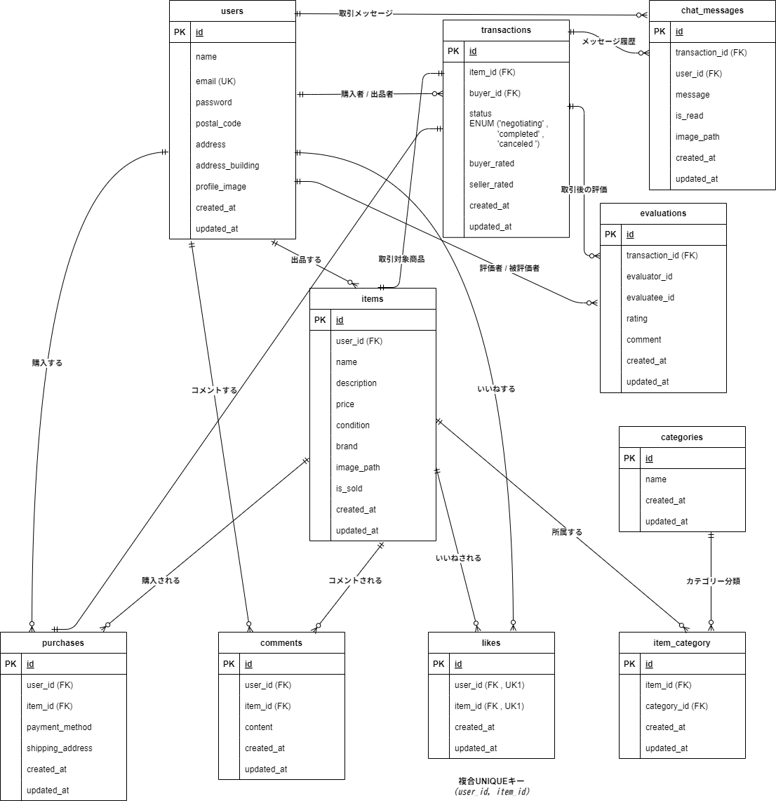

## アプリケーション名
模擬案件：フリマアプリ  

---

## ER図
下記は本アプリケーションで使用しているテーブルとリレーションを表したER図です。  


### テーブル概要
- users … ユーザー情報（認証やプロフィール）を管理  
- items … 出品する商品情報を管理  
- purchases … 購入履歴とStripe決済情報（決済ID、支払いステータス）を管理（決済・住所など）  
- comments … 商品に対するコメントを管理  
- likes … 商品への「いいね」を管理（多対多を中間テーブルで実装）  
- categories … 商品のカテゴリ情報を管理する  
- items_categories … itemsとcategoriesの多対多関係を管理する中間テーブル  
---

## プロジェクト概要
本プロジェクトは、Laravelを使用してアイテムの出品と購入を行う機能を備えたフリマアプリです。  
以下の機能を提供します。  

---

## 主な機能
- **ユーザー認証機能**
  - 会員登録（フォームバリデーション：メールアドレスの重複、パスワード8文字以上 など）  
  - ログイン／ログアウト（Fortify を利用）  
  - 初回ログイン時のプロフィール設定・編集  
  - メール認証機能  
    - 登録時に認証メールが送信され、リンクをクリックして認証を完了するまでログインできない仕様  
    - MailHogを使用して開発環境でメール送信を確認可能  
    - **パスワード表示切替機能**
    - 会員登録画面およびログイン画面のパスワード入力欄に目のアイコン「パスワードトグル（Password Toggle）アイコン」を設置  
    - アイコンをクリックすることで、入力したパスワードを表示または非表示に切り替え可能  
    - ユーザーが入力内容を確認しやすくなる工夫を実装  
- **商品一覧表示 (トップ画面)**
  - 全商品を表示  
  - 「売り切れ」のステータス表示  
  - ログイン済みの場合「マイリスト(いいね済み)」タブに切り替え可能  
- **商品詳細表示**
  - 商品名、説明、値段、状態、カテゴリ、ブランド など  
  - コメント一覧＆コメント投稿機能  
  - いいね数の表示・いいね／いいね解除  
- **商品検索機能**
  - キーワード検索（部分一致）  
  - 検索履歴や検索結果のリスト表示  
- **出品機能**
  - 商品名、説明、価格、状態、カテゴリ、画像アップロード  
  - バリデーションエラー時はメッセージ表示  
  - 出品後に商品詳細 or 一覧へリダイレクト  
- **購入機能**
  - 支払い方法選択（コンビニ支払い・カード支払い）  
  - Stripeを利用した決済処理を実装  
  - 配送先変更機能  
  - 商品購入後は 「sold」ラベルがアニメーションで表示  
- **マイページ (プロフィール)**
  - 購入履歴一覧、出品した商品一覧の閲覧  
  - プロフィール編集（住所、建物名、画像アップロードなど）  
---

## 必要な環境
- **PHP**: バージョン 7.3 以上
- **Laravel**: バージョン 8.75
- **Composer**: バージョン 2.0 以上
- **MySQL**: バージョン 8.0 以上
- **Docker**: バージョン 27.2.0 以上
- **Docker Compose**: バージョン 2.0 以上
- **MailHog**: バージョン 1.0 以上
  - メール送信を開発環境で確認するためのツール
- **Stripe**: 決済処理用のAPI  
  - `.env`ファイルに以下の内容を追加してください。
    ```dotenv
    STRIPE_KEY=your_test_public_key
    STRIPE_SECRET=your_test_secret_key
    ```
  - Stripe Dashboardにアクセスして、[テスト決済](https://dashboard.stripe.com/test/payments)を確認できます。
---

## URL
- アプリケーション: `http://localhost` （Nginx経由）  
- phpMyAdmin: `http://localhost:8080`  
---

## デフォルトのデータベース設定
`docker-compose.yml` で設定されているデータベースの初期情報は以下の通りです。  
デフォルトのパスワードをそのまま本番環境で使用しないでください。

- データベース名: `laravel_db`
- ユーザー名: `laravel_user`
- パスワード: `laravel_pass`
- MySQLのルートパスワード: `root`

---

## セットアップ方法
1.リポジトリをクローンする
   リポジトリを GitHub からローカルにコピーします。  

     git clone https://github.com/shimodum/mock-project-flea-market-app.git

   **クローン後、プロジェクトディレクトリに移動します**:  

      cd mock-project-flea-market-app
   
2.Docker コンテナを起動する  
   Docker Compose を使用して必要なサービスを立ち上げます。  
      初回起動や Dockerfile に変更があった場合には、以下のコマンドを実行してコンテナをビルドし直します。

    docker-compose up -d --build
   
3.依存関係をインストールする  
 　 PHP コンテナ内で Composer を使ってライブラリをインストールします。

    docker-compose exec php composer install
 
4.環境変数を設定する  
　 環境設定ファイル .env.example を .env にコピーし、アプリケーションの秘密鍵を生成します。

     cp .env.example .env  
     php artisan key:generate

5.ストレージへのシンボリックリンクを作成する  
  アップロード画像が適切に表示されるよう、ストレージと公開フォルダをリンクします。
   
    php artisan storage:link
   
6.データベースをマイグレートする  
  アプリケーションで使用するデータベースのテーブルを作成します。
   
    php artisan migrate
   
7.データをシーディングする  
　必要な初期データをデータベースに投入します。

    php artisan db:seed
   
8.MailHog のセットアップと確認  
  MailHog は Docker コンテナ内で動作するメールキャプチャツールです。  
  開発環境で送信されるメールを MailHog で確認できます。  

  - MailHog は `docker-compose up -d` を実行すると自動的に起動します。  
  - MailHogは`http://localhost:8025` にアクセスすることで確認できます。  

   環境設定ファイル `.env` に以下の内容が設定されていることを確認してください。

       MAIL_MAILER=smtp  
       MAIL_HOST=mailhog  
       MAIL_PORT=1025  
       MAIL_USERNAME=null  
       MAIL_PASSWORD=null  
       MAIL_ENCRYPTION=null   
  
9.JavaScript ファイルのロード確認  
   本アプリでは以下の JavaScript ファイルを使用しています。  

- `common.js`  
  - パスワード表示切替機能（パスワードトグルアイコン）
- `item.js`  
  - 商品情報の管理に関連する処理
- `like.js`  
  - いいね機能の処理（追加・削除）
- `profile.js`  
  - プロフィール編集・画像アップロードの処理
- `purchase.js`  
  - 購入手続き関連の処理

これらのファイルが `resources/js/` に存在し、適切にビルド・読み込まれていることを確認してください。

10.Stripe APIキーの設定  
  環境ファイル`.env`にStripeのAPIキーを設定します。これにより、アプリケーションでStripe決済機能が有効になります。  

    STRIPE_KEY=your_test_public_key  
    STRIPE_SECRET=your_test_secret_key

  **テスト決済確認:**  
テスト用クレジットカード番号 `4242 4242 4242 4242` を使用できます。  
有効期限は未来の日付、CVCは任意の3桁を入力してください。  
決済結果は [Stripe Dashboard](https://dashboard.stripe.com/test/payments) で確認できます。  

### テスト手順
本アプリケーションでは PHPUnit による自動テストを実行できます。

### 1. テストデータの準備
    php artisan migrate:fresh --seed

### 2. PHPUnit テストの実行
    php artisan test --testdox > test_report.html

### 3. テスト結果の確認
  test_report.html を開いて結果を確認できます。  
  ターミナル上で直接出力する場合は以下を実行します。  

    php artisan test --testdox


### テスト成功の確認基準

以下の項目が確認できれば、テストは成功と判断できます。

### 1. ユーザー登録・認証
- 新規ユーザー登録を行い、エラーメッセージが適切に表示される（例：パスワードが短すぎる、メールアドレスの形式が正しくない など）。
- メール認証を実施し、未認証ユーザーがログインできないことを確認する。
- 正しい情報でログインでき、間違った情報ではログインできないことを確認する。

### 2. 商品管理機能
- 商品の新規出品ができることを確認する（バリデーションチェックを含む）。
- 出品した商品が一覧画面に正しく表示されることを確認する。
- 商品の詳細ページにアクセスし、情報が正しく表示されることを確認する。
- 商品に対してコメントを投稿し、画面上に正しく反映されることを確認する。
- 商品に「いいね」を付ける・解除することができるか確認する。

### 3. 購入・決済機能
- 商品をカートに追加し、購入画面に進めることを確認する。
- 配送先情報を変更できることを確認する。
- Stripeを利用した決済が正常に完了することを確認する（テスト用カードを使用）。
- 購入完了後、商品ステータスが「sold」になり、再購入できないことを確認する。

### 4. マイページ機能
- マイページで購入履歴、出品した商品一覧が正しく表示されることを確認する。
- プロフィールの編集・画像アップロードが正しく機能することを確認する。

### 5. その他
- 未ログイン状態で特定のページにアクセスした際、適切にログインページへリダイレクトされることを確認する。
- ページ遷移が設計通りに動作することを確認する（ボタン・リンクの動作チェック）。
- エラーハンドリングが適切に動作し、想定外の入力でアプリがクラッシュしないことを確認する。
